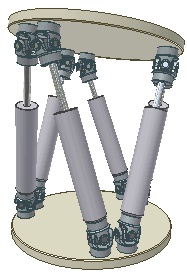
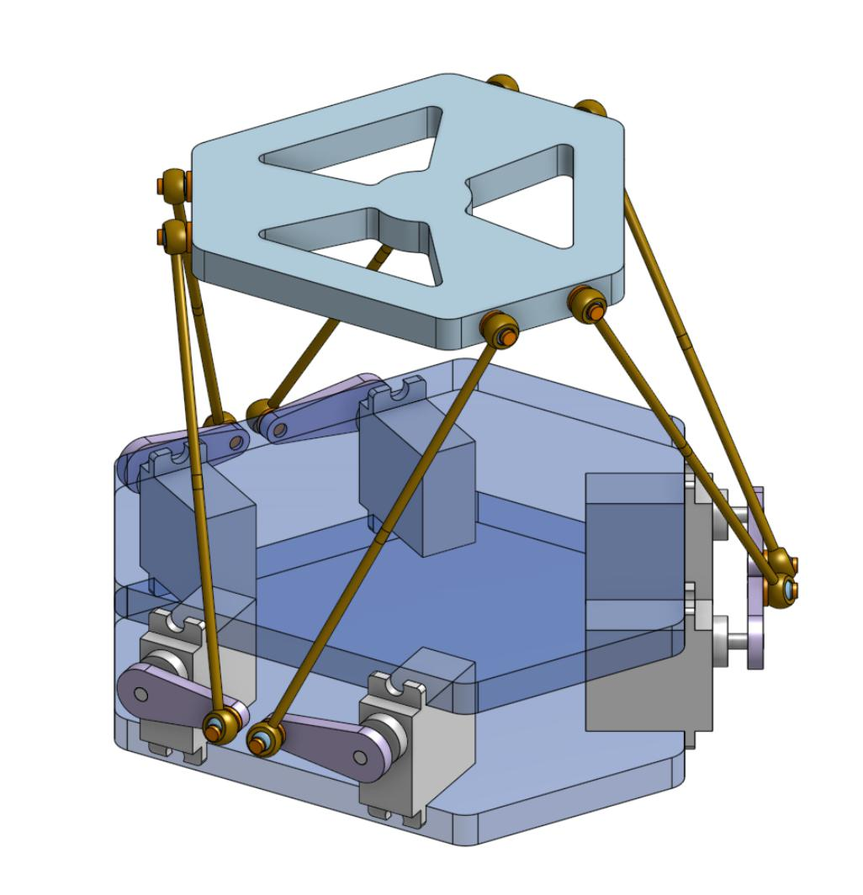

# Plateforme de Stewart

## Sommaire 
* TOC
{:toc}

## 🔹 Qu’est-ce qu’une plateforme de Stewart ?

Une **plateforme de Stewart**, également appelée **plateforme hexapode**, est un système mécatronique permettant de positionner et d’orienter une plateforme mobile dans l’espace selon **six degrés de liberté**.

Ces six degrés de liberté correspondent à :
- trois **translations** : X, Y, Z  
- trois **rotations** : roulis (*roll*), tangage (*pitch*) et lacet (*yaw*)
  
<table style="border: none;">
  <tr style="border: none;">
    <td style="border: none;" width="38%">
      
    </td>
    <td style="border: none;" width="62%">
      
    </td>
  </tr>
</table>
---

## 🧩 Principe de fonctionnement

La structure est composée de :
- une **base fixe**
- une **plateforme mobile**
- **six actionneurs** (vérins ou bras motorisés) reliant la base à la plateforme mobile

Chaque actionneur peut faire varier sa longueur.  
En ajustant précisément la longueur des six actionneurs, il est possible de contrôler simultanément la **position** et l’**orientation** de la plateforme mobile.

Les mouvements sont obtenus grâce au calcul de la **cinématique inverse** :  
à partir d’une position et d’une orientation souhaitées, le système détermine la longueur que doit prendre chaque actionneur.

---

## Première version

Cette première itération a été conçue comme une **Preuve de Concept (PoC)** à coût maîtrisé. En utilisant des matériaux simples et des techniques de prototypage rapide, l'objectif était de valider la chaîne de contrôle et les algorithmes de cinématique inverse avant d'engager le développement d'une version optimisée. 

### ⚙️ Architecture mécanique

La structure repose sur une configuration hexagonale classique, choisie pour sa stabilité et sa symétrie, facilitant ainsi la modélisation géométrique du système.

- **Châssis** : Les plateformes inférieure (base fixe) et supérieure (plateforme mobile) ont été réalisées par découpe de bois et d'acrylique. Ce mélange de matériaux a permis un prototypage rapide tout en conservant une rigidité suffisante pour cette phase de test.

- **Transmission** : Le mouvement est transmis via des bras de levier de 25 mm (issus du modélisme RC).

- **Liaisons & Cinématique** :

    - Les biellettes sont constituées de **tiges filetées M3 de 200 mm**, permettant un ajustement précis de la hauteur initiale de la plateforme.

    - Les liaisons pivots et rotules sont assurées par des **chapes à rotule M3**, garantissant les degrés de liberté nécessaires aux mouvements d'inclinaison sans contraintes structurelles excessives.

### 📟 Architecture électronique

La mise en mouvement est assurée par **6 servomoteurs MG996R (couple de 9 kg.cm)**, pilotés par un **microcontrôleur ESP32** et alimentés par une source de laboratoire stabilisée.

Bien que ces actionneurs permettent un prototypage à coût maîtrisé, leur résolution limitée a mis en évidence des défis de stabilité. Les imprécisions mécaniques internes des servos tendent à amplifier les phénomènes d'oscillation dans les boucles de rétroaction, impactant la fluidité globale du système sur cette première version.

L'unité de contrôle (ESP32) est reliée à l'ordinateur par un câble USB-C. Ce dernier sert d'interface bidirectionnelle : il assure **l'alimentation** du microcontrôleur tout en servant de **bus de communication** pour le transfert des consignes de mouvement générées par l'IHM.

### 🖥️ Architecture informatique

La partie IHM et calculs de cinématique inverse est réalisée par le pc via deux codes : 
  - IHM sous **Processing** (récupérée du projet de felixros2401) et améliorée selon mes besoins.
  - Calculs de cinématique inverse sous Python (récupérés et adaptés depuis le projet de felixros2401).
  - Communication entre ces 2 programmes via ....
  - Envoie des consignes à l'ESP32 via le port série.

## Sources

Projet principal m'ayant inspiré : 
* **Felixros2401** : [Accéder au dépôt GitHub]([https://github.com/lien-du-projet](https://github.com/felixros2401/Stewart-Platform))
